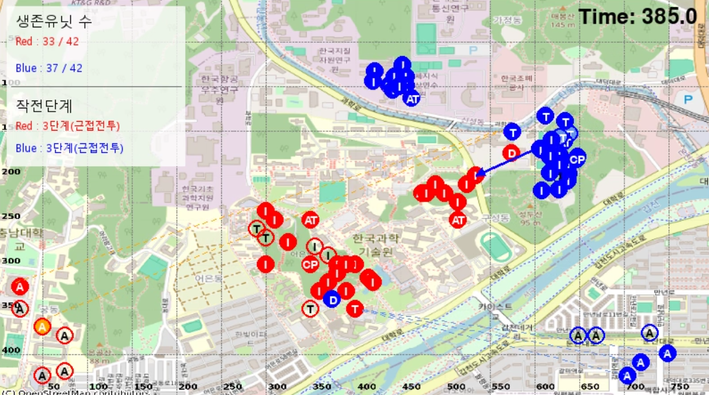

# 워 게임 시뮬레이션 (War Game Simulation)


이 프로젝트는 워 게임을 시뮬레이션하는 Python (pygame) 기반 프로그램입니다. 두 팀(RED와 BLUE)이 다양한 유닛(포병, 드론, 전차, 대전차, 보병, 지휘소)을 사용하여 전투를 수행합니다.

## 프로젝트 구조

```
war-game-modeling/
├── config.yaml           # 시뮬레이션 설정 파일
├── simulation.py         # 메인 시뮬레이션 로직
├── requirements.txt      # 프로젝트 의존성
├── model/               # 모델 관련 코드
│   ├── command.py       # 명령 관련 로직
│   ├── detect.py        # 탐지 관련 로직
│   ├── event.py         # 이벤트 시스템
│   ├── fire.py          # 사격 관련 로직
│   ├── function.py      # 거리 계산 로직
│   ├── movement.py      # 이동 관련 로직
│   ├── probabilities.py # 확률 관련 로직
│   ├── terrain.py       # 지형 관련 로직
│   ├── unit.py          # 유닛 클래스 정의
│   └── visualization.py # 시각화 관련 코드
├── results/              # 시뮬레이션 결과 저장
└── database/             # 데이터베이스 관련 파일
```

## 설치 방법

1. Python 3.7 이상이 필요합니다. (개발 버전 Python 3.11.8)
2. 필요한 패키지를 설치합니다:
```bash
pip install -r requirements.txt
```

## 실행 방법

기본 실행:
```bash
python simulation.py
```

옵션:
- `--time-scale`: 시간 스케일 조정 (기본값: 5.0)
- `--sim_speed`: 시뮬레이션 속도 조정 (기본값: 1.0)
- `--detection`: 탐지 시각화 활성화
- `--eligible_TL`: 사격 가능 시각화 활성화
- `--fire`: 사격 시각화 활성화

예시:
```bash
python simulation.py --time-scale 2.0 --eligible_TL T --fire T
```

## 설정 파일 (config.yaml)

`config.yaml` 파일에서 다음 설정을 조정할 수 있습니다:

- `max_time`: 시뮬레이션 최대 실행 시간
- `video`: 비디오 녹화 설정
  - `enabled`: 비디오 녹화 활성화 여부
  - `output_path`: 출력 비디오 파일 경로
  - `fps`: 비디오 프레임 레이트
- `initial_positions`: 각 팀의 초기 유닛 배치
- 유닛 수량 설정:
  - `num_artillery_red/blue`: 포병 수
  - `num_drone_red/blue`: 드론 수
  - `num_tank_red/blue`: 전차 수
  - `num_at_red/blue`: 대전차 수
  - `num_infantry_red/blue`: 보병 수
  - `num_cp_red/blue`: 지휘소 수
- 시뮬레이션 설정:
  - `pixel_to_meter_scale`: 픽셀-미터 변환 비율
  - `lethal_radius`: 포병 사거리
  - `mountain_detect_prob`: 산지 탐지 확률
  - `drone_elevation`: 드론 고도

## 주요 기능

1. **유닛 관리**
   - 다양한 유닛 타입 지원 (포병, 드론, 전차, 대전차, 보병, 지휘소)
   - 각 유닛의 상태, 위치, 행동 관리

2. **전투 시스템**
   - 사격 메커니즘
   - 탐지 시스템
   - 이동 시스템

3. **시각화**
   - 실시간 전투 상황 시각화
   - 탐지, 사격, 이동 시각화 옵션
   - 비디오 녹화 기능

4. **명령 시스템**
   - 지휘소를 통한 상황 평가
   - 작전 단계별 명령 실행

## 결과

시뮬레이션 결과는 python 파일을 실행하면 확인할 수 있습니다.
또는 [`results/`](./results/simulation_final.mp4) 디렉토리에 저장된 결과를 확인할 수 있습니다.



## 모델 파일 상세 설명

### command.py
- 작전 단계 관리
- 상황 평가
- 명령 생성 및 실행 

### detect.py
- 유닛 간 탐지 가능 여부 판단
- 탐지 확률 계산
- 정보 공유 메커니즘

### event.py
- 이벤트 타입 정의 (이동, 사격 등)
- 이벤트 우선순위 큐 관리
- 이벤트 처리 로직 구현

### fire.py
- 사격 가능 타겟 판단
- 사격 정확도 계산
- 피해 처리 로직

### function.py
- `movement.py` 내 거리 계산을 위한 함수
- 공격 유닛의 거리 계산

### movement.py
- 경로 계획
- 이동 속도 계산
- 장애물 회피

### probabilities.py
- `database/*.csv` 파일로부터 명중 확률 및 살상확률을 불러옴

### terrain.py
- 지형 관련 로직 구현
- DEM을 통한 고도 정보 불러옴

### unit.py
- 유닛의 기본 속성(위치, 상태, 팀 등) 정의
- 유닛 타입별 특성 구현
- 유닛의 행동(이동, 사격, 탐지 등) 관리

### visualization.py
- Pygame을 사용한 실시간 시각화
- 유닛, 탐지 범위, 사격 효과 등의 시각화
- 비디오 녹화 기능 구현
